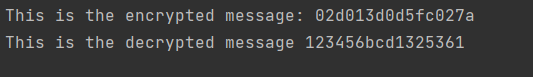

# Symmetric Ciphers. Stream Ciphers. Block Ciphers.

### Course: Cryptography & Security
### Author: Papuc Elena

----
## Objectives:
1. Get familiar with the symmetric cryptography, stream and block ciphers.

2. Implement an example of a stream cipher.

3. Implement an example of a block cipher.

## Theory
&ensp;&ensp;&ensp; Symmetric Cryptography deals with the encryption of plain text when having only one encryption key which needs to remain private. Based on the way the plain text is processed/encrypted there are 2 types of ciphers:
- Stream ciphers:
    - The encryption is done one byte at a time.
    - Stream ciphers use confusion to hide the plain text.
    - Make use of substitution techniques to modify the plain text.
    - The implementation is fairly complex.
    - The execution is fast.
- Block ciphers:
    - The encryption is done one block of plain text at a time.
    - Block ciphers use confusion and diffusion to hide the plain text.
    - Make use of transposition techniques to modify the plain text.
    - The implementation is simpler relative to the stream ciphers.
    - The execution is slow compared to the stream ciphers.
    

## Implementation:
### Block Cipher : DES
&ensp;&ensp;&ensp; In order to implement DES, we have to perform, first of all, 
the initial permutation. The IP(initial permutation) takes the initial 64 bit string and replaces each bit
with the one on the respective position in the IP table:
````
public static int[] IP
            = { 58, 50, 42, 34, 26, 18, 10, 2,  60, 52, 44,
                36, 28, 20, 12, 4,  62, 54, 46, 38, 30, 22,
                14, 6,  64, 56, 48, 40, 32, 24, 16, 8,  57,
                49, 41, 33, 25, 17, 9,  1,  59, 51, 43, 35,
                27, 19, 11, 3,  61, 53, 45, 37, 29, 21, 13,
                5,  63, 55, 47, 39, 31, 23, 15, 7 };
````
&ensp;&ensp;&ensp; So, in this case, the first bit will be replaced with the 58th, the second with the 50th, and so on.
To implement this, we call the method Permutation that takes as arguments, the aforementioned IP table
and the plain text on which the permutations should be performed:
````
public static String Permutation(int[] sequence, String input)
        {
            String output = "";
            input = Hex2Binary(input);
            for (int i = 0; i < sequence.Length; i++)
                output += input[sequence[i] - 1];
            output = Binary2Hex(output);
            return output;
        }
````
&ensp;&ensp;&ensp; Next, the 64-bit key is permuted according to the following table, PC-1.
The table takes into account the need to disregard every 8th bit. So, the table has 56 entries as 
opposed to 64.
````
public static int[] PC1
            = { 57, 49, 41, 33, 25, 17, 9,  1,  58, 50,
                42, 34, 26, 18, 10, 2,  59, 51, 43, 35,
                27, 19, 11, 3,  60, 52, 44, 36, 63, 55,
                47, 39, 31, 23, 15, 7,  62, 54, 46, 38,
                30, 22, 14, 6,  61, 53, 45, 37, 29, 21,
                13, 5,  28, 20, 12, 4 };
````
&ensp;&ensp;&ensp; Now that the key was permuted, we can split it in 2 even parts,
that are going to be left shifted 16 times in order to generate 16 keys. Each iteration has 
a specific number of left shifts that are represented in this table:
````
public static int[] shiftBits = { 1, 1, 2, 2, 2, 2, 2, 2,
            1, 2, 2, 2, 2, 2, 2, 1 };
````
&ensp;&ensp;&ensp; So, the first iteration has 1 shift, the second also one, the third - 2, and so on.
After that, the left and the right side should be united and permuted again, to get 48
bit keys, according to this table"
````
  public static int[] PC2
            = { 14, 17, 11, 24, 1,  5,  3,  28, 15, 6,
                21, 10, 23, 19, 12, 4,  26, 8,  16, 7,
                27, 20, 13, 2,  41, 52, 31, 37, 47, 55,
                30, 40, 51, 45, 33, 48, 44, 49, 39, 56,
                34, 53, 46, 42, 50, 36, 29, 32 };
````
&ensp;&ensp;&ensp; This is the method used to generate the sixteen 48 bit keys.
````
public static String[] GetKeys(string key)
        {
            String[] keys = new String[16];
            // first key permutation
            key = Permutation(PC1, key);
            for (int i = 0; i < 16; i++) {
                key = LeftRotate(key.Substring(0, 7), shiftBits[i])
                      + LeftRotate(key.Substring(7, 14), shiftBits[i]);
                // second key permutation
                keys[i] = Permutation(PC2, key);
            }
            return keys;
        }
````
&ensp;&ensp;&ensp; Then, there have to be executed 16 practical cycles, one for each key.
In a practical cycle, the right side of the text has to be expanded from 32 bits to 48 with the help
of an E-box:
```
 static int[] EP = { 32, 1,  2,  3,  4,  5,  4,  5,  6,  7,
            8,  9,  8,  9,  10, 11, 12, 13, 12, 13,
            14, 15, 16, 17, 16, 17, 18, 19, 20, 21,
            20, 21, 22, 23, 24, 25, 24, 25, 26, 27,
            28, 29, 28, 29, 30, 31, 32, 1 };
```
&ensp;&ensp;&ensp; After that, we have a xor operation between the right side which has been
expanded and the key of the iteration, both of them being 48 bit long at the moment.
Xor is nothing but a an addition modulo 2.
```
 static string Xor(string input, string key)
        {
            input = Hex2Binary(input);
            key = Hex2Binary(key);
            StringBuilder newString = new StringBuilder();
            for (int i = 0; i < input.Length; i++)
            {
                newString.Append((input[i] + key[i]) % 2);
            }

            return Binary2Hex(newString.ToString());
        }
```
&ensp;&ensp;&ensp; Next, we have to look into the S-boxes. There is 8 substitution boxes
that help diminish the number of bits from 48 to 32. The 48 bit string is divided into 
8 parts each having 6 bits. Each part is operated on by a different S-box. The lookup is realised
by combining the first and last of the six bits and converting that number to an integer
(from 0 to 3) which represents the row. The column is represented by the combination of the other 4 bits
(from 0 to 15). 
```
public static String sBoxLookup(String input)
        {
            String output = "";
            input = Hex2Binary(input);
            for (int i = 0; i < 48; i += 6) {
                String temp = input.Substring(i, 6);
                int num = i / 6;
                int row = Convert.ToInt32(temp[0]+ "" + temp[5], 2);
                int col = Convert.ToInt32(temp.Substring(1, 4), 2);
                output += Convert.ToString(sBox[num,row,col], 16);
            }
            return output;
        }
```
&ensp;&ensp;&ensp; After obtaining the 32 bit string, we are going to permute it again 
using the P table.
```
  public static int[] P
            = { 16, 7, 20, 21, 29, 12, 28, 17, 1,  15, 23,
                26, 5, 18, 31, 10, 2,  8,  24, 14, 32, 27,
                3,  9, 19, 13, 30, 6,  22, 11, 4,  25 };
```
&ensp;&ensp;&ensp; Then, we are going to xor it with the left side. This way, we obtain a new right side.
```
static String PracticalCycle(String input, String key, int num)
        {
            // Dividing the input string into 2 parts
            String left = input.Substring(0, 8);
            String temp = input.Substring(8, 8);
            String right = temp;
            // Expansion permutation
            temp = Permutation(EP, temp);
            // xor temp and key
            temp = Xor(temp, key);
            //lookup in s-box table
            temp = sBoxLookup(temp);
            // Straight D-box
            temp = Permutation(P, temp);
            // xor
            left = Xor(left, temp);

            // swapper
            return right + left;
        }
```
&ensp;&ensp;&ensp; Lastly, we need to swap once again the right side with the left side of the 64
bit string, and perform one last permutation, with the table IP1:
```
 public static int[] IP1
          = { 40, 8,  48, 16, 56, 24, 64, 32, 39, 7,  47,
            15, 55, 23, 63, 31, 38, 6,  46, 14, 54, 22,
            62, 30, 37, 5,  45, 13, 53, 21, 61, 29, 36,
            4,  44, 12, 52, 20, 60, 28, 35, 3,  43, 11,
            51, 19, 59, 27, 34, 2,  42, 10, 50, 18, 58,
            26, 33, 1,  41, 9,  49, 17, 57, 25 };
```
&ensp;&ensp;&ensp; This is the full encrypting method:
```
 public string Encrypt(string plainText, string key)
        {
            int i;
            // get 16 keys
            String[] keys = GetKeys(key);
 
            // initial permutation
            plainText = Permutation(IP, plainText);
          
            // 16 rounds
            for (i = 0; i < 16; i++) {
                plainText = PracticalCycle(plainText, keys[i], i);
            }
 
            // last swap
            plainText = plainText.Substring(8, 8) + plainText.Substring(0, 8);
 
            // final permutation
            plainText = Permutation(IP1, plainText);
            return plainText;
        }
```
&ensp;&ensp;&ensp; The method for decryption is basically the same with one key difference. If in the 
encryption we went first key to last key in the 16 rounds process, now we go last to first.
````
public string Decrypt(string plainText, string key)
        {
            ...
           
            // 16 rounds
            for (i = 15; i > -1; i--) {
                plainText = PracticalCycle(plainText, keys[i], 15 - i);
            }
            ....
 
````
Finally, we manage to get the desired result:




### Stream Cipher : RC4
&ensp;&ensp;&ensp; In order to implement RC4, first of all, we need to generate an S array
, which is just an array going from 0 to 255:
```
 static int[] Sarray()
        {
            int[] S = new int [256];
            for (int i = 0; i < 256; i++)
            {
                S[i] = i;
            }

            return S;
        }
```
&ensp;&ensp;&ensp; Then, we initialize a temporary array T. If the length of the key is
256 bytes, then, the key is assigned to T:
```
if (key.Length == 256)
            {
                Buffer.BlockCopy(key, 0, T, 0, key.Length);
            }
```
&ensp;&ensp;&ensp; However, if it is different, then we copy the key to the temporary 
table entirely, and then copy it again as many times as needed to fill the temporary table:
```
 else
            {
                for (int i = 0; i < 256; i++)
                {
                    T[i] = key[i % key.Length];
                }
            }
```

&ensp;&ensp;&ensp; We use T to produce the initial permutation of S. 
Starting with S[0] to S[255], and for each S[i] algorithm swaps it with another byte in S according 
to a scheme dictated by T[i], but S will still contain values from 0 to 255 :

```
 int j = 0;
            for (int i = 0; i < 256; i++)
            {
                j = (j + S[i] + T[i]) % 256;
                SwapNum(ref S[i], ref S[j]);
            }
```
&ensp;&ensp;&ensp; This concludes the Key Scheduling Algorithm, which outputs 
S - a scrambled 256 bytes array. This array is used for the Pseudo Random Generation Algorithm
which outputs the bytes of the real key stream. For as many iterations as are needed, the PRGA 
modifies the state and outputs a byte of the keystream. In each iteration, the PRGA:

- increments i;
- looks up the ith element of S, S[i], and adds that to j;
- exchanges the values of S[i] and S[j], then uses the sum S[i] + S[j] (modulo 256) as an index to fetch a third element of S (the keystream value K below);
- calculates the bitwise exclusive or between plaintext and keystream to generate a ciphertext.
```
 static byte[] PRGAlgorithm(int[] S, byte[] plaintext)
        {
            int j = 0;
            int i = 0;
            int k = 0;
            Byte[] result = new byte[plaintext.Length];
         
            for (int l = 0; l < plaintext.Length; l++)
            {
                i = (i + 1) % 256;
                j = (j + S[i]) % 256;
                SwapNum(ref S[i], ref S[j]);
                int t = (S[i] + S[j]) % 256;
                k = S[t];
                result[l] = Convert.ToByte(plaintext[l] ^ k);
            }
            return result;
        }
```

&ensp;&ensp;&ensp; After the encryption, follows decryption, that in RC4 is done by exactly the same
algorithm, meaning the KSA followed by the PRGA. There is one thing that needs to be done, 
due to the fact that I opted to have the ciphertext in hexadecimal form, I need to take the 
bytes in the cipher text 2 by 2, and convert them to integers, in order to form the correct byte array:
```
            for(int i = 0; i < message.Length; i += 2)
            {
                byte r = Convert.ToByte(message.Substring(i, 2), 16);
                list.Add(r);
            }
            
            foreach (var ele in list)
            {
                data[l] = ele;
                l++; 
            }
```
