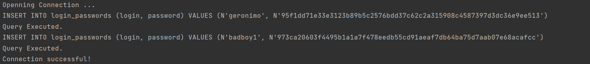
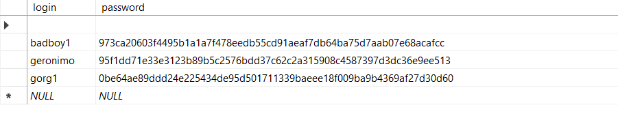

## Hash functions and Digital Signatures.
### Course: Cryptography & Security
### Author: Papuc Elena

----
## Objectives:
1. Get familiar with the hashing techniques/algorithms.
2. Use an appropriate hashing algorithms to store passwords in a local DB.
3. Use an asymmetric cipher to implement a digital signature process for a user message.

## Theory

&ensp;&ensp;&ensp; Hashing is the process of transforming any given key or a string of characters into another value. This is usually represented by a shorter, fixed-length value or key that represents and makes it easier to find or employ the original string.

&ensp;&ensp;&ensp; A cryptographic hash function is a mathematical function used in cryptography. Typical hash functions take inputs of variable lengths to return outputs of a fixed length. A cryptographic hash function combines the message-passing capabilities of hash functions with security properties.

&ensp;&ensp;&ensp; A hashing algorithm is a mathematical function that garbles data and makes it unreadable. Hashing algorithms are one-way programs, so the text can't be unscrambled and decoded by anyone else.

&ensp;&ensp;&ensp; Hashing is important because it offers a method for retrieving data that's secure and efficient. It's also quicker than most traditional sorting algorithms, which makes it more efficient for retrieving data. Here are some benefits to using hashing:

- Better data security: Hashing enables stronger data security by preventing attackers from getting access to passwords. It's much more difficult to change or misuse a hashed password.
- Easier comparability: Hashing compares two files instantly and determines if they're distinct by using their hash value. This makes it easier to verify a file after it's moved to another location.
- Easier verification: Hashing quickly verifies the integrity of a file once it's transferred from one location to another. Users can simply compare the hash value of both files to ensure the file didn't get corrupted during the transfer.
- Ability to control speed: Hashing makes it easy to control the speed of retrieval by balancing the speed with the amount of space. This can make it quicker than searching for lists and arrays.

&ensp;&ensp;&ensp; A digital signature is an electronic, encrypted, stamp of authentication on digital information such as email messages, macros, or electronic documents. A signature confirms that the information originated from the signer and has not been altered.

## Implementation:

### SHA-256 Hashing Algorithm 

&ensp;&ensp;&ensp; SHA 256 is a part of the SHA 2 family of algorithms, where SHA stands for Secure Hash Algorithm.
The significance of the 256 in the name stands for the final hash digest value, i.e. irrespective of the size of plaintext/cleartext, the hash value will always be 256 bits.

&ensp;&ensp;&ensp; In this laboratory, I used the SHA-256 hashing algorithm to store the passwords of 2 users in 
and SQL Server Database. The SHA-256 algorithm is implemented in the C# library "EasyEncryption".
This algorithm takes any string input and produces a string of 256 bits. It is necessary for storing
passwords in case a malicious user gets access to the database.

```
 public static string HashPassword(string input)
        {
            return SHA.ComputeSHA256Hash(input);
        }
```

&ensp;&ensp;&ensp; In order to implement this part of the laboratory I hardcoded 2 users with 
logins and passwords that must be stored in the database(in class ClientPassword). Then, I filled the dictionary
"Passwords" in class DictionaryPasswords with the login as key and the hashed password as value, since there can't be more than 1 users with the same
login. 

&ensp;&ensp;&ensp; After that, I created an SQL connection with the MS SQL Server database "Passwords" and I populated 
the table "login_password" with the elements in the dictionary.

```
public void Connect()
        {
           ...
            string connString = @"Data Source=" + datasource + ";Initial Catalog="
                                + database + ";Persist Security Info=True;User ID=" + username + ";Password=" +
                                password;

            SqlConnection conn = new SqlConnection(connString);
            try
            {
                Console.WriteLine("Openning Connection ...");

                conn.Open();

                IQuery query = new AddQuery();
                query.execute(conn);
            ...
         }
```

&ensp;&ensp;&ensp; This is the result of executing the query for adding elements to the table.



&ensp;&ensp;&ensp; This is the table filled with the 2 aforementioned users, and one test user that I added earlier.



### Digital Signature Process

&ensp;&ensp;&ensp; In order to implement the digital signature process for a 
user's message, there had to be implemented several steps.

&ensp;&ensp;&ensp; First of all, the message has to be processed by a hashing algorithm.
 ```
  string message = "Hello FAF-201";
  string hashMessage = SHA256.HashPassword(message);
 ```

&ensp;&ensp;&ensp; Then, the message was encrypted with the help of the RSA algorithm,
which is an asymmetrical algorithm implemented previously.

```
  Cipher cipher = new RSA();
  string encryptedMessage = cipher.Encrypt(hashMessage, string.Empty);         
```

&ensp;&ensp;&ensp; The last step is to perform the signature check which is done 
by comparing the values of the hashed string with the result of the decryption algorithm

```
 public void CheckSignature(string hash, string encryption)
        {
            Cipher cipher = new RSA();
            if(cipher.Decrypt(encryption, string.Empty) == hash) 
                Console.WriteLine("Valid");
            else Console.WriteLine("Non Valid");
        }
```

&ensp;&ensp;&ensp; In reality, the process is little bit different, because this process is done between 2 entities, the signer and the recipient. The digital signature is basically a one-way hash (or message digest) of the original data that was encrypted with the signer's private key. 
To validate the data's integrity, the recipient first uses the signer's public key to decrypt the digital signature. 

&ensp;&ensp;&ensp; The recipient then uses the same hashing algorithm that generated the original hash to generate a new one-way hash of the same data. Information 
about the hashing algorithm used is sent with the digital signature.

&ensp;&ensp;&ensp; Finally, the recipient compares the two hash values. If they match, the data has not changed since it was signed. If the hashes do not match, the data may have been tampered with since it was first signed or the digital signature may have been created with a private key that does not correspond to the public key presented by the signer.